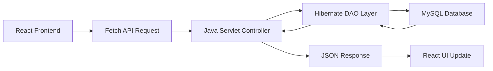

# 🛍️ Product Management System

[](https://react.dev/)
[](https://www.java.com/)
[](https://hibernate.org/)
[](https://www.mysql.com/)
[](https://tomcat.apache.org/)
[](https://maven.apache.org/)
[](https://github.com/FasterXML/jackson)

---

# 📋 Project Overview

> **Product Management System** is a Full Stack Web Application developed using **React.js, Java Servlets, Hibernate ORM, MySQL, Apache Tomcat, and Maven**. It allows users to browse, search, and manage products through a responsive interface while demonstrating complete frontend-backend integration using REST APIs.

This project demonstrates:

* Full Stack Java Development
* REST API Integration
* Hibernate ORM
* MVC Architecture
* React Frontend Development
* CRUD Operations
* JSON Data Exchange using Jackson

---

# ✨ Features at a Glance

| Module                | Key Features                                                              |
| --------------------- | ------------------------------------------------------------------------- |
| 👤 **User Module**    | • User Registration<br>• User Login<br>• Admin Login                      |
| 📦 **Product Module** | • View Products<br>• Search Products<br>• Add Product<br>• Update Product |
| 🔍 **Search System**  | • Search Products by Name<br>• Dynamic Product Filtering                  |
| 🗄️ **Database**      | • Hibernate ORM<br>• MySQL Integration                                    |
| 🌐 **REST APIs**      | • JSON Request & Response<br>• Fetch API Integration                      |
| 🖥️ **Frontend**      | • Responsive React UI<br>• Component-Based Architecture                   |

---

# 🚀 Workflow Diagram



---

# 🛠️ Tech Stack

| Technology    | Usage                 |
| ------------- | --------------------- |
| React.js      | Frontend Development  |
| Java Servlets | Backend Controller    |
| Hibernate ORM | Database ORM          |
| MySQL         | Database              |
| Maven         | Dependency Management |
| Apache Tomcat | Web Server            |
| Jackson       | JSON Processing       |
| HTML5         | UI Structure          |
| CSS3          | Styling               |
| JavaScript    | Client-side Logic     |

---

# 📂 Project Structure

```text
Product-Management-System
│
├── Product_managment/          # React Frontend
│   ├── src
│   ├── public
│   └── package.json
│
├── src/
│   ├── Controller
│   ├── daoInterface
│   ├── daoimpl
│   ├── database
│   ├── model
│   └── utility
│
├── pom.xml
└── README.md
```

---

# 🗄️ Database Tables

### Products

* Product ID
* Product Name
* Description
* Price
* Discount Price
* Rating
* Brand
* Stock
* Product Images

### Users

* User ID
* Name
* Email
* Password

---

# ⚡ Installation & Setup

## 🔹 Backend Setup

```bash
git clone https://github.com/PranavNanaware05/Product-Management-System.git

cd Product-Management-System

mvn clean install
```

Deploy the generated WAR file on Apache Tomcat.

Backend runs on:

```text
http://localhost:8080/ProductManagment
```

---

## 🔹 Frontend Setup

```bash
cd Product_managment
npm install
npm run dev
```

Frontend runs on:

```text
http://localhost:5173
```

---

# 🔑 REST API Endpoints

## Product APIs

| Method | Endpoint                      | Description      |
| ------ | ----------------------------- | ---------------- |
| GET    | `/Product`                    | Get All Products |
| GET    | `/Product?search=productName` | Search Product   |
| POST   | `/Product`                    | Add Product      |
| PUT    | `/Product`                    | Update Product   |

---

## User APIs

| Method | Endpoint             | Description       |
| ------ | -------------------- | ----------------- |
| POST   | `/User?action=login` | User Login        |
| POST   | `/User`              | User Registration |

---

# 🔄 Hibernate Operations Used

* Entity Mapping
* SessionFactory
* Session
* Transactions
* HQL Queries
* CRUD Operations

---

# 🌍 Project Workflow

1. User interacts with the React frontend.
2. React sends HTTP requests using the Fetch API.
3. Java Servlets receive and process the requests.
4. DAO layer performs CRUD operations using Hibernate.
5. Hibernate communicates with the MySQL database.
6. Data is converted into JSON using Jackson.
7. React receives the response and updates the UI.

---

# 🚀 Future Improvements

* 🔐 JWT Authentication
* 🛒 Shopping Cart Module
* ❤️ Wishlist Feature
* 📷 Product Image Upload
* 📄 Pagination & Sorting
* 📊 Admin Dashboard
* ☁️ Cloud Deployment

---

# 📸 Screenshots

> Add screenshots of:

* 🏠 Home Page
* 🔐 Login Page
* 👤 Registration Page
* 📦 Product Listing
* ➕ Add Product
* 🔍 Search Product

---

# 👨‍💻 Author

## **Pranav Nanaware**

**Full Stack Java Developer**

Passionate about Java, Hibernate, React.js, REST APIs, and Full Stack Web Development.

* **GitHub:** https://github.com/PranavNanaware05
* **LinkedIn:** *(Add your LinkedIn Profile URL)*

---

# 📜 License

This project is developed for educational and learning purposes.
